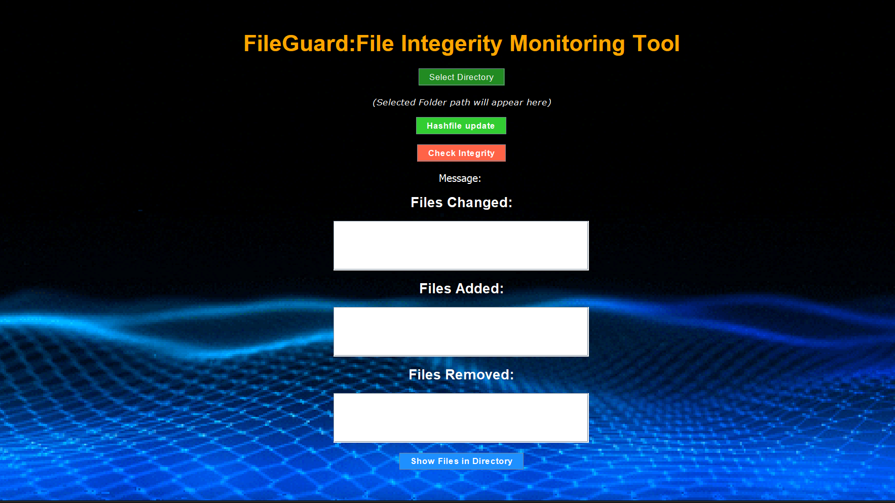

# FileGuard:Integrity Monitoring Tool

## Description

The **FileGuard** is a file integrity monitoring tool written in Java. This tool helps monitor and validate the integrity of files in a specified directory. It computes hash values (SHA-256) of the files, saves them, and then compares these hashes to detect any changes in the files. This can be used to detect unauthorized file modifications, ensuring data integrity.




## Features

- Computes SHA-256 hash of files in a directory.
- Monitors the files for changes or modifications.
- Compares saved hash values with current file hashes to detect alterations.
- Simple console-based application (authentication required for security).

## Prerequisites

- Java 8 or higher

## How to Run

1. Clone the repository:
    ```bash
    git clone https://github.com/VedanshPundir/FileGuard.git
    ```

2. Navigate to the project directory:
    ```bash
    cd FileGuard
    ```

3. Compile the Java files:
    ```bash
    javac HashLineFileMonitor.java
    ```

4. Run the program:
    ```bash
    java HashLineFileMonitor
    ```

5. You will be prompted to log in with a username and password (hardcoded for testing purposes).

## File Structure

- `HashLineFileMonitor.java`: Main Java file for monitoring file integrity.
- `giphy.gif`: (Optional) A gif showcasing the program's functionality in the GUI (if applicable).
- `resources/`: (Optional) Folder containing additional resources like sample data files or images.

## Example Usage

Once you run the program, the following prompt will appear:

```bash
Enter your username:Vedansh
Enter your password:Vedansh1234
